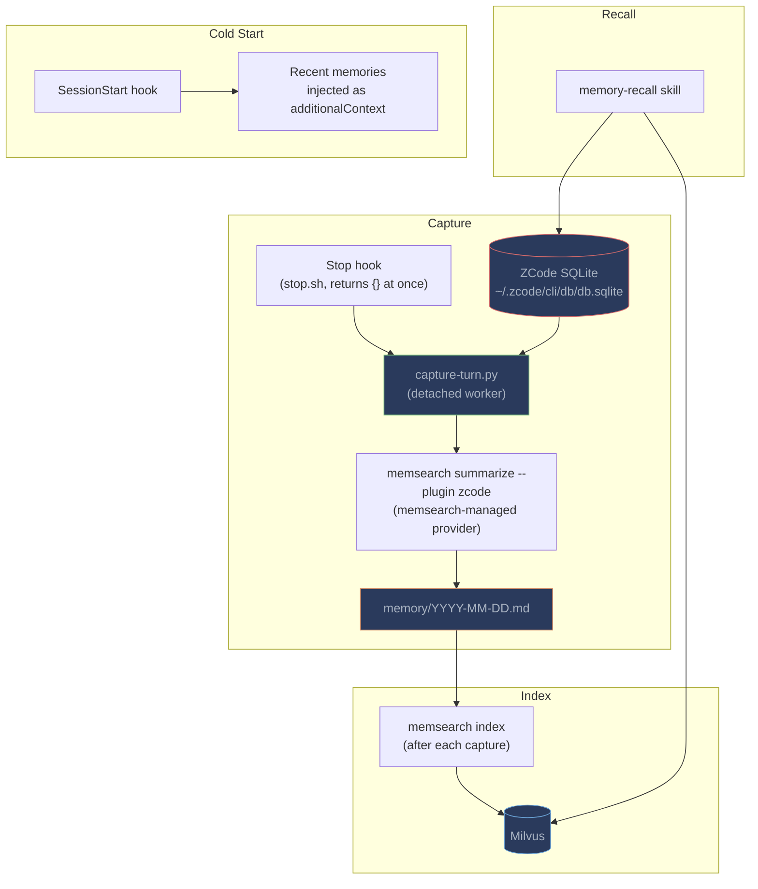
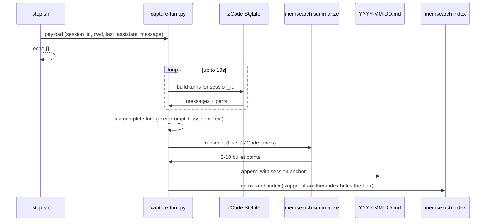

# How It Works

## What Happens Automatically

| Event | What memsearch does |
|-------|-------------------|
| **SessionStart** | Detects memsearch CLI, derives the collection name, runs a one-time index (Lite) or starts `memsearch watch` (Server), injects the status line and recent memories via `additionalContext` |
| **UserPromptSubmit** | Adds a `[memsearch] Recall available if needed` hint so ZCode knows the memory-recall skill applies |
| **Stop** | Records the hook payload and spawns the detached capture worker, then returns immediately |
| **Worker** | Waits for ZCode to commit the turn, reads it from SQLite, summarizes, appends to the daily `.md`, re-indexes, wakes maintenance |

---

## Architecture



---

## Why a Detached Worker?

ZCode's hooks are Claude Code-compatible in shape, but two runtime details shape the design:

- **Hooks run inline.** The `async` flag has no effect, so anything the Stop hook does blocks the ZCode UI until it finishes. LLM summarization cannot run inside the hook.
- **`transcript_path` is a stand-in.** ZCode writes a temporary one-line JSONL for each hook: the Stop hook only sees the last assistant message, and UserPromptSubmit only sees the prompt. The real conversation lives in ZCode's SQLite database.

`stop.sh` therefore writes the hook payload to `<store>/.zcode-capture/` and launches `scripts/capture-turn.py` with `nohup`/`setsid` and all file descriptors redirected, then prints `{}`.

### Worker Flow



Step by step:

1. **Wait for the commit** -- ZCode may persist the final assistant message slightly after the Stop hook fires. The worker polls the database for up to `MEMSEARCH_ZCODE_DB_WAIT_S` seconds (default 10) until the last turn's final assistant step finished for a reason other than `tool-calls`.
2. **Skip subagents** -- sessions with a `parent_id` belong to subagents and are not captured.
3. **Group into a turn** -- the last real user message (`semantics.origin = real_user`; runtime reminders and synthetic parts are ignored) plus its assistant text parts. Reasoning and tool parts are skipped so the summarizer sees a clean transcript.
4. **Summarize** -- `memsearch summarize --plugin zcode` through the provider configured in `plugins.zcode.summarize.provider`. With no provider the worker stores a plain `User asked / ZCode` extract.
5. **Write to memory** -- appends under a lazily created `## Session HH:MM` heading with a `<!-- session:ID turn:ID db:PATH -->` anchor. Anchors are checked first, so a re-fired hook never duplicates an entry.
6. **Re-index** -- runs `memsearch index` under a non-blocking lock. If a session-start index or a previous turn's index is still running, the worker skips and the next capture catches up.
7. **Maintenance** -- runs `maintenance-runner.py --platform zcode` for due project-review, user-profile, and skill-distillation tasks.

If the database is unavailable, the worker falls back to the payload's `last_assistant_message` so the turn is not lost entirely.

---

## Cold-Start Context

On session start, `session-start.sh` builds a status line and a preview of the two most recent daily journals, capped at about 1.8 KB, and returns them as `hookSpecificOutput.additionalContext`:

```text
[memsearch v0.4.20] embedding: onnx/bge-m3 | milvus: ~/.memsearch/milvus.db | collection: ms_my_app_a1b2c3d4

# Recent Memory

## 2026-09-15.md
## Session 14:30
### 14:30
- User asked how the hook runner handles timeouts
- ZCode explained that command hooks use seconds and process hooks use milliseconds
```

ZCode only surfaces `systemMessage` for Stop hooks, so the status line travels as context as well.

---

## Memory Files

Memory lives in the centralized per-project store, keyed by the same collection name every memsearch plugin derives from the repository root (linked worktrees share it):

```
~/.memsearch/projects/ms_my_app_a1b2c3d4/memory/
├── 2026-09-13.md
├── 2026-09-14.md
└── 2026-09-15.md
```

### Example Memory File

```markdown
# 2026-09-15

## Session 14:30

### 14:30
<!-- session:sess_abc123 turn:msg_def456 db:~/.zcode/cli/db/db.sqlite -->
- User asked how the hook runner handles timeouts
- ZCode explained that command hooks use seconds and process hooks use milliseconds
- ZCode fixed the plugin's hooks.json to use `timeout` in seconds

### 15:15
<!-- session:sess_abc123 turn:msg_789ghi db:~/.zcode/cli/db/db.sqlite -->
- User reported that a plugin skill was shadowed by a user-scope skill
- ZCode explained the discovery order and renamed the plugin skill
```

The `db:` anchor points the memory-recall skill at ZCode's SQLite database for L3 transcript reads.

---

## Differences from Other Plugins

| Aspect | ZCode | Claude Code | Codex | OpenCode |
|--------|-------|-------------|-------|----------|
| **Capture** | Stop hook + detached SQLite reader | Stop hook (async, transcript JSONL) | Stop hook (rollout JSONL) | SQLite daemon (polling) |
| **Summarizer** | `memsearch summarize` (provider) | `claude -p --model haiku` | `codex exec` | `opencode run` |
| **L3 source** | ZCode SQLite DB | Claude Code JSONL | Codex rollout JSONL | OpenCode SQLite DB |
| **Recall trigger** | Skill (main context) | Skill in forked subagent | Skill (main context) | Tool-based |
| **Install** | Plugin marketplace | Plugin marketplace | `install.sh` + hooks.json | npm + opencode.json |
| **Recursion prevention** | Worker sets `MEMSEARCH_DISABLE` | `CLAUDECODE=` env var | Isolated CODEX_HOME | XDG_CONFIG_HOME isolation |

---

## Plugin Files

```
plugins/zcode/
├── .zcode-plugin/plugin.json     # Plugin manifest
├── hooks/
│   ├── hooks.json                # SessionStart / UserPromptSubmit / Stop
│   ├── common.sh                 # Shared setup (mirrors the Claude Code plugin)
│   ├── session-start.sh          # Status line + recent memory via additionalContext
│   ├── user-prompt-submit.sh     # Recall capability hint
│   └── stop.sh                   # Records payload, spawns the capture worker
├── scripts/
│   ├── capture-turn.py           # Detached worker: read turn → summarize → append → index
│   ├── zcode_turns.py            # SQLite turn builder shared by capture and L3
│   ├── parse-transcript.py       # L3 deep drill into ZCode's SQLite database
│   ├── derive-collection.sh      # Per-project collection name
│   └── maintenance-runner.py     # Project review / user profile / skill distillation
├── prompts/                      # Shared prompt templates (synced)
└── skills/
    ├── memory-recall/            # Hand-maintained for ZCode
    ├── memory-config/            # Synced from plugins/_shared
    └── memory-to-skill/          # Synced from plugins/_shared
```
