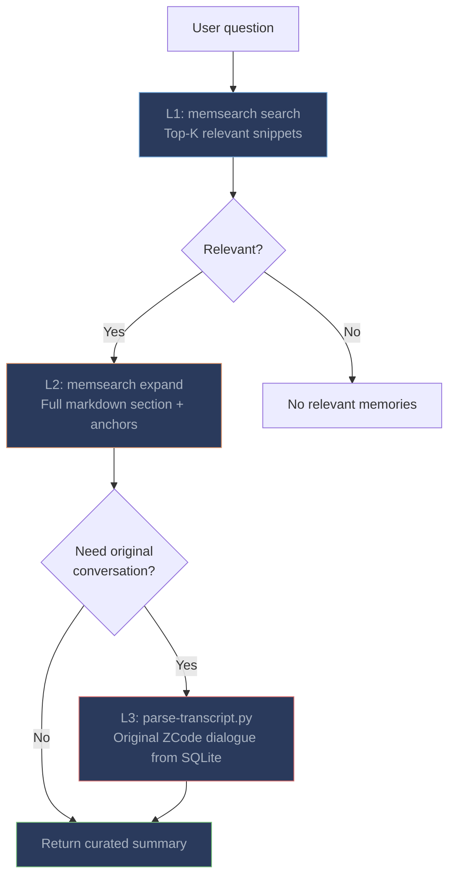

# Memory Recall

Memory retrieval is handled by the `memsearch-zcode:memory-recall` skill. ZCode invokes it when it judges that the user's question could benefit from historical context, and the SessionStart and UserPromptSubmit hooks keep that option visible with `[memsearch] Recall available if needed` hints.

---

## How to Trigger

**Manual invocation** -- invoke the skill with a query:

```
$memory-recall what did we decide about the hook timeout units?
```

**Auto invocation** -- ask naturally; ZCode invokes the skill when it senses the question needs history:

```
We fixed a plugin skill shadowing issue last week, what was the fix?
```

---

## Three-Layer Progressive Recall



| Layer | Command | What it returns |
|-------|---------|----------------|
| **L1: Search** | `memsearch search "<query>" --top-k 5 --json-output --default-collection <collection>` | Top-K chunk snippets with relevance scores |
| **L2: Expand** | `memsearch expand <chunk_hash> --default-collection <collection>` | Full markdown section with session anchors |
| **L3: Transcript** | `python3 "$PLUGIN_ROOT/scripts/parse-transcript.py" <session_id> --turn <turn_id> --context 3` | Original conversation turns from ZCode's SQLite database |

The skill resolves `PLUGIN_ROOT` from `~/.zcode/cli/plugins/installed_plugins.json` and the collection name with `scripts/derive-collection.sh`, so the same commands work whichever marketplace the plugin was installed from.

### Real-World Example

**User:** "We fixed a plugin skill shadowing issue last week. What was the fix?"

**L1 -- search:** ZCode runs `memsearch search "plugin skill shadowed by user-scope skill"`:
```json
[
  {
    "chunk_hash": "a1b2c3...",
    "score": 0.88,
    "content": "- User reported that a plugin skill was shadowed by a user-scope skill\n- ZCode explained the discovery order and renamed the plugin skill...",
    "source": "~/.memsearch/projects/ms_my_app_a1b2c3d4/memory/2026-09-08.md"
  }
]
```

**L2 -- expand:** ZCode runs `memsearch expand a1b2c3...`:
```markdown
### 15:15
<!-- session:sess_abc123 turn:msg_789ghi db:~/.zcode/cli/db/db.sqlite -->
- User reported that a plugin skill was shadowed by a user-scope skill
- ZCode explained the discovery order: user skills win over plugin skills with the same name
- ZCode renamed the plugin skill to avoid the collision
```

**L3 -- transcript (optional):** when the exact commands matter, ZCode runs `parse-transcript.py sess_abc123 --turn msg_789ghi --context 1` and reads the original exchange.

**ZCode response:** "Last week the plugin skill was shadowed because a same-named skill in `~/.zcode/skills` takes precedence over plugin skills. The fix was renaming the plugin skill."

---

## Anchors From Other Agents

Memories written by other memsearch plugins on the same repository carry their own anchors (`transcript:` for Claude Code, `rollout:` for Codex). The skill recognizes them and falls back to `memsearch transcript <path>` for those files, so cross-platform recall still reaches the original conversation.

---

## Tips

**Let ZCode decide.** The cold-start context and the capability hints give ZCode enough information to invoke the skill autonomously; you rarely need to ask for a search explicitly.

**Check the collection.** Recall and capture must agree on the collection. Both derive it from the repository root, so sessions opened in a subdirectory or a linked worktree still share the same memory.

**Explore the markdown when unsure.** The skill lists recent journals under `~/.memsearch/projects/<collection>/memory/` when it cannot form a concrete query -- the markdown is always the source of truth.
